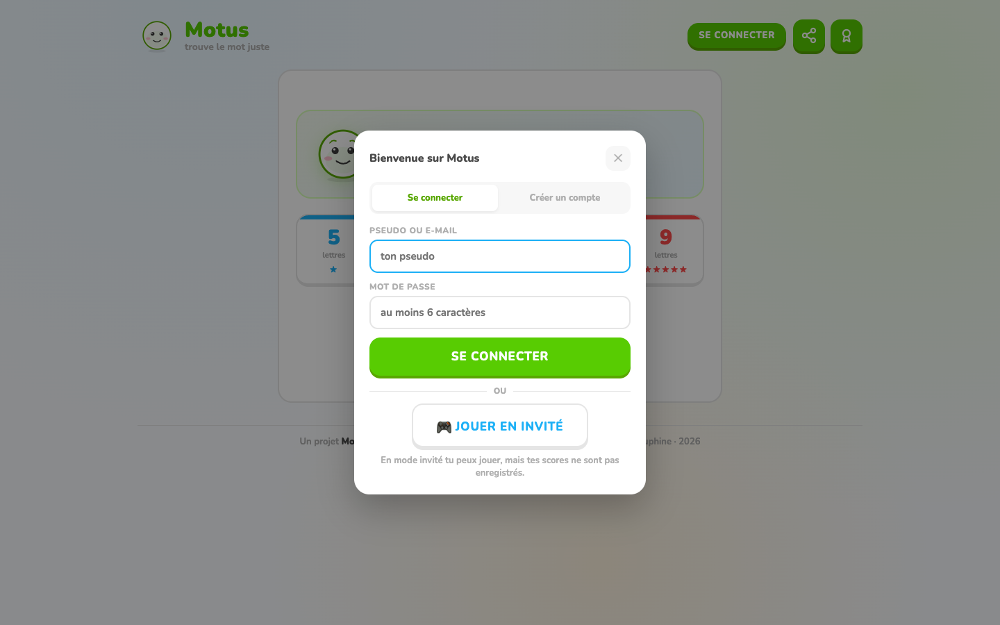
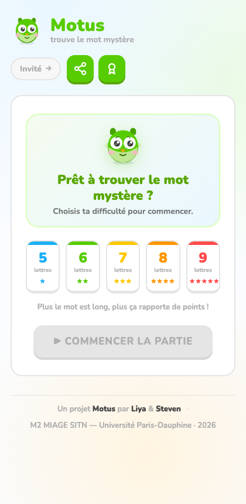
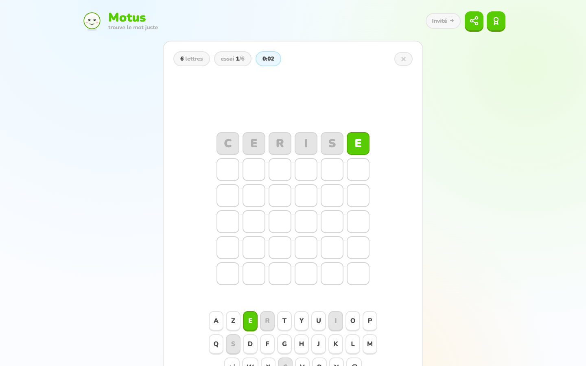
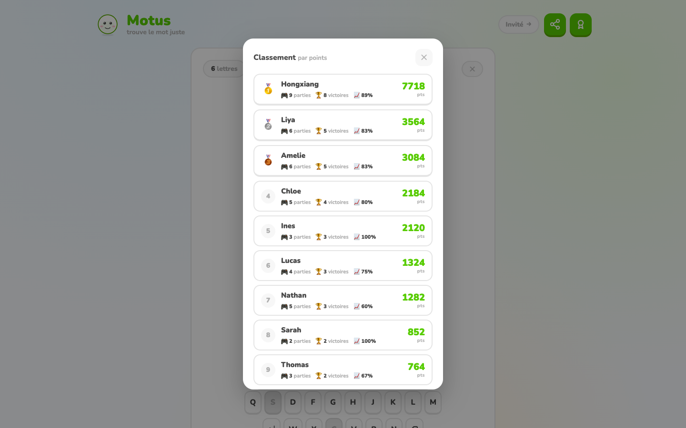
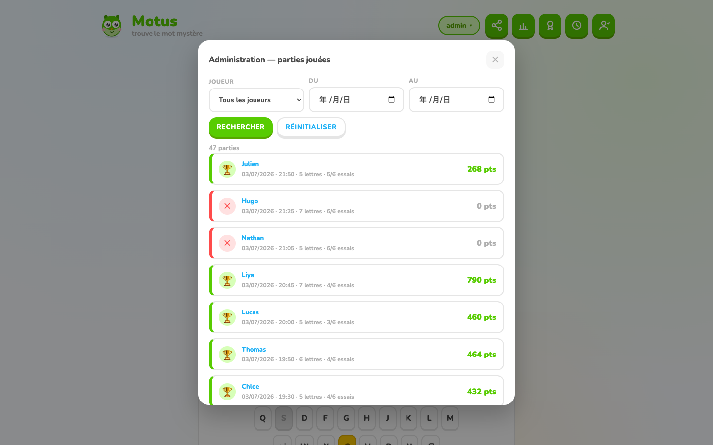
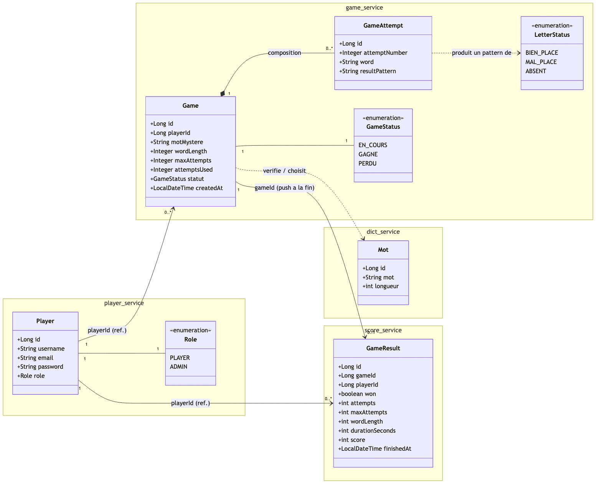

<div align="center">

</div>

# Motus — jeu de mots en microservices


Projet **Applications Web orientées Services** — M2 MIAGE SITN, Université Paris-Dauphine (2025-2026).

Une réimplémentation du jeu **Motus** (le mot mystère de 5 à 9 lettres) sous forme de **quatre microservices Spring Boot** indépendants, orchestrés par Docker Compose et déployables sur Kubernetes (Minikube), avec un frontend web statique.



## Sommaire

- [Aperçu](#aperçu)
- [Captures d'écran](#captures-décran)
- [Architecture](#architecture)
- [Diagramme de classes](#diagramme-de-classes)
- [Stack technique](#stack-technique)
- [Démarrage rapide (Docker Compose)](#démarrage-rapide-docker-compose)
- [Déploiement Kubernetes (Minikube)](#déploiement-kubernetes-minikube)
- [API — résumé des endpoints](#api--résumé-des-endpoints)
- [Fonctionnalités](#fonctionnalités)
- [Structure du dépôt](#structure-du-dépôt)
- [Équipe](#équipe)

## Aperçu

Un joueur choisit une longueur de mot (5 à 9 lettres, difficulté croissante), puis dispose de 6 essais pour deviner le mot mystère. Chaque tentative est validée contre un dictionnaire français et donne un retour lettre par lettre (bonne place / mal placée / absente), comme au Motus télévisé. Les parties sont chronométrées et notées ; les joueurs inscrits voient leur historique et leur progression dans un classement global. Un compte **administrateur** permet de superviser l'ensemble des parties jouées, tous joueurs confondus.

## Captures d'écran

| Accueil / connexion | Partie en cours |
|---|---|
|  |  |

| Classement | Administration |
|---|---|
|  |  |

## Architecture

Le projet suit une architecture microservices : chaque service possède sa propre base de données MySQL (isolation des données) et communique avec les autres via des appels REST synchrones.

```
                                   ┌──────────────────┐
                                   │     Frontend      │
                                   │  (HTML/CSS/JS)     │
                                   └─────────┬──────────┘
                                             │ REST (JSON)
              ┌──────────────────────────────┼──────────────────────────────┐
              │                              │                              │
    ┌─────────▼─────────┐          ┌─────────▼─────────┐          ┌─────────▼─────────┐
    │  player-service     │          │   game-service      │          │   score-service     │
    │  (8081)             │          │   (8082)            │          │   (8084)            │
    │  comptes joueurs,   │          │   parties, essais,  │◄────────►│   scores, historique,│
    │  authentification   │          │   validation        │  push    │   classement, admin  │
    └─────────┬───────────┘          └─────────┬───────────┘          └─────────┬───────────┘
              │                                │ appelle                        │
              │                      ┌─────────▼─────────┐                      │
              │                      │   dict-service      │                      │
              │                      │   (8083)            │                      │
              │                      │   dictionnaire FR,  │                      │
              │                      │   mots aléatoires   │                      │
              │                      └─────────┬───────────┘                      │
              │                                │                                 │
    ┌─────────▼─────────┐          ┌─────────▼─────────┐          ┌─────────▼─────────┐
    │  motus_players (DB) │          │  motus_games (DB)   │          │  motus_dictionary/  │
    │                     │          │                     │          │  motus_scores (DB)  │
    └─────────────────────┘          └─────────────────────┘          └─────────────────────┘
```

- **player-service** (port `8081`) — gestion des comptes joueurs : inscription, connexion, consultation de profil.
- **game-service** (port `8082`) — logique de jeu : création d'une partie, soumission d'un essai, calcul du feedback lettre par lettre. Appelle `dict-service` pour choisir/valider les mots, et pousse le résultat final à `score-service`.
- **dict-service** (port `8083`) — dictionnaire français : mot aléatoire par longueur, vérification d'existence d'un mot.
- **score-service** (port `8084`) — persistance des résultats de parties, statistiques par joueur, classement global, et recherche/filtrage des parties pour l'administration.

Chaque service expose son API REST et persiste ses données dans sa propre base MySQL (`motus_players`, `motus_games`, `motus_dictionary`, `motus_scores`), toutes hébergées par une unique instance MySQL en développement.

## Diagramme de classes

Le modèle métier est réparti entre les quatre microservices : chaque service possède ses propres entités JPA et sa propre base de données. Il n'y a donc pas de clé étrangère entre services — les liens (`playerId`, `gameId`) sont de simples références par identifiant, résolues au niveau applicatif (appels REST), pas au niveau base de données.



- **player-service** : `Player` (avec son `Role`, `PLAYER` ou `ADMIN`).
- **game-service** : `Game` (1 partie) compose plusieurs `GameAttempt` (les essais) ; `Game` référence un `GameStatus` et interroge `dict-service` pour choisir/valider un mot.
- **dict-service** : `Mot`, le dictionnaire français utilisé pour choisir le mot mystère et valider les essais.
- **score-service** : `GameResult`, le résultat persistant d'une partie terminée (poussé par game-service à la fin de la partie), utilisé pour le classement, les statistiques et l'administration.

## Stack technique

- **Backend** : Java 26, Spring Boot 4, Spring Data JPA, Spring Web (REST)
- **Base de données** : MySQL 8
- **Frontend** : HTML / CSS / JavaScript (vanilla, sans framework), single-page app
- **Conteneurisation** : Docker, Docker Compose
- **Orchestration** : Kubernetes (manifests fournis dans [`k8s/`](k8s/)), testé sur Minikube
- **Build** : Maven (un `pom.xml` par service)

## Démarrage rapide (Docker Compose)

Prérequis : Docker Desktop installé et lancé.

```bash
git clone https://github.com/Steven-1105/M2_SITN_Motus.git
cd M2_SITN_Motus
docker compose up --build
```

Cette commande démarre :
- une base **MySQL** partagée (port `3307` côté hôte, une base par service),
- les quatre microservices Spring Boot (`8081`–`8084`),
- attend que MySQL soit prêt (`healthcheck`) avant de lancer les services.

Une fois les services démarrés (les logs affichent `Started ...Application in X seconds` pour chacun), servez le frontend statique :

```bash
cd frontend
python3 -m http.server 8090
```

Puis ouvrez [http://localhost:8090](http://localhost:8090) dans un navigateur.

**Compte de démonstration administrateur** : identifiant `admin`, mot de passe `admin123` (rôle `ADMIN`, permet d'accéder au panneau d'administration). Douze comptes joueurs de démonstration peuplent également le classement.

Pour arrêter et supprimer les conteneurs :

```bash
docker compose down
```

## Déploiement Kubernetes (Minikube)

Des manifests Kubernetes sont fournis dans [`k8s/`](k8s/) (un déploiement + service par microservice, plus MySQL et l'autoscaling).

```bash
minikube start
cd k8s
./deploy.sh          # applique les manifests dans l'ordre
./port-forward.sh    # expose les services en local pour les tester
```

Voir [`k8s/README.md`](k8s/README.md) pour le détail de chaque manifest et des commandes de vérification (`kubectl get pods`, `kubectl logs`, etc.).

## API — résumé des endpoints

### player-service (`:8081/players`)
| Méthode | Endpoint | Description |
|---|---|---|
| `POST` | `/players` | Inscription d'un nouveau joueur |
| `POST` | `/players/login` | Connexion (retourne le profil + rôle) |
| `GET` | `/players/{id}` | Détail d'un joueur |
| `GET` | `/players` | Liste de tous les joueurs |

### game-service (`:8082/games`)
| Méthode | Endpoint | Description |
|---|---|---|
| `POST` | `/games` | Démarre une nouvelle partie (longueur de mot au choix) |
| `POST` | `/games/{id}/guess` | Soumet un essai, retourne le feedback lettre par lettre |
| `GET` | `/games/{id}` | Détail d'une partie en cours |
| `GET` | `/games` | Liste des parties |

### dict-service (`:8083/words`)
| Méthode | Endpoint | Description |
|---|---|---|
| `GET` | `/words/random` | Mot aléatoire pour une longueur donnée |
| `POST` | `/words/validate` | Valide qu'un mot existe dans le dictionnaire |
| `GET` | `/words/exists` | Vérifie l'existence d'un mot |
| `GET` | `/words/lengths` | Longueurs de mots disponibles |

### score-service (`:8084/scores`)
| Méthode | Endpoint | Description |
|---|---|---|
| `POST` | `/scores/results` | Enregistre le résultat d'une partie (appelé par game-service) |
| `GET` | `/scores/ranking` | Classement global des joueurs |
| `GET` | `/scores/players/{id}` | Statistiques d'un joueur (victoires, moyenne, etc.) |
| `GET` | `/scores/games` | Liste/recherche des parties — filtres `playerId`, `from`, `to` |

## Fonctionnalités

- **Gestion des joueurs** : inscription, connexion, mode invité (partie non sauvegardée).
- **Gestion des parties** : choix de la longueur du mot (5 à 9 lettres, difficulté croissante), 6 essais, retour visuel lettre par lettre, minuteur.
- **Suivi des scores** : score par partie, statistiques individuelles, historique des parties jouées.
- **Classement** : classement global de tous les joueurs par points cumulés.
- **Administration** : un compte de rôle `ADMIN` peut lister et filtrer l'ensemble des parties jouées par joueur et par période

## Structure du dépôt

```
.
├── docker-compose.yml       # orchestration locale des 4 services + MySQL
├── frontend/                 # single-page app (HTML/CSS/JS)
├── player-service/           # microservice comptes joueurs (Spring Boot)
├── game-service/             # microservice logique de jeu (Spring Boot)
├── dict-service/             # microservice dictionnaire (Spring Boot)
├── score-service/            # microservice scores/classement/admin (Spring Boot)
├── k8s/                      # manifests Kubernetes + scripts de déploiement
└── docs/screenshots/         # captures d'écran utilisées dans ce README
```

## Équipe

- **Hongxiang** — player-service, game-service
- **Liya** — dict-service, score-service, frontend
