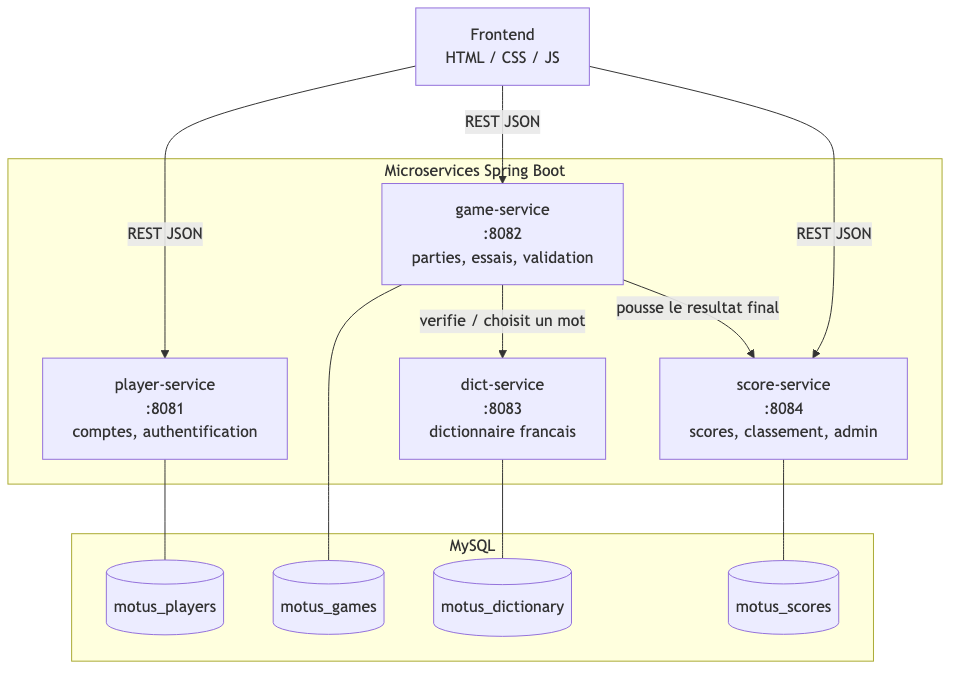

<div align="center">
  
</div>

# Motus — jeu de mots en microservices

Projet **Applications Web orientées Services** · M2 MIAGE SITN · Université Paris-Dauphine · 2025-2026

Binôme : **Liya** & **Hongxiang**

---

## Sommaire

- [Aperçu](#aperçu)
- [Prérequis](#prérequis)
- [Lancement](#lancement)
- [Comptes de démonstration](#comptes-de-démonstration)
- [Services](#services)
- [Architecture](#architecture)
- [Diagramme de classes](#diagramme-de-classes)
- [Stack technique](#stack-technique)
- [Endpoints API](#endpoints-api)
- [Structure du dépôt](#structure-du-dépôt)
- [Déploiement Kubernetes](#déploiement-kubernetes)
- [Arrêter](#arrêter)
- [Dépannage](#dépannage)
- [Équipe](#équipe)

## Aperçu

| Connexion | Partie en cours | Classement |
|---|---|---|
|  |  |  |

| Choix de la difficulté | Panneau d'administration |
|---|---|
|  |  |

## Prérequis

- **Docker Desktop** (démarré)
- **Python 3** (pour servir le frontend statique)
- Ports libres : `3306`, `8081`, `8082`, `8083`, `8084`, `8090`

## Lancement

```bash
git clone https://github.com/Steven-1105/M2_SITN_Motus.git
cd M2_SITN_Motus
docker compose up --build -d          # MySQL + les 4 microservices
cd frontend && python3 -m http.server 8090
# puis ouvre http://localhost:8090
```

Le dictionnaire (~132 000 mots) charge en environ 30 secondes au premier démarrage.

## Comptes de démonstration

| Identifiant | Mot de passe | Rôle |
|-------------|--------------|------|
| `admin`     | `admin123`   | ADMIN — accès au panneau d'administration |
| _(inscription libre)_ | _(6 caractères min.)_ | PLAYER |

Douze comptes joueurs (Liya, Hongxiang, Amelie, Nathan…) peuplent aussi le classement de démo.

Le mode **invité** est disponible depuis l'écran de connexion : les scores ne sont pas enregistrés.

## Services

| Service         | Port | Description                                        |
|-----------------|------|----------------------------------------------------|
| player-service  | 8081 | Inscription, connexion, gestion des joueurs        |
| game-service    | 8082 | Création de partie, feedback lettre par lettre     |
| dict-service    | 8083 | Dictionnaire français, tirage aléatoire, validation |
| score-service   | 8084 | Historique, classement, administration             |

Chaque service a sa propre base MySQL (`motus_players`, `motus_games`, `motus_dictionary`, `motus_scores`) : pas de clé étrangère entre services, uniquement des références par identifiant résolues via appel REST.

## Architecture

Le frontend communique en REST/JSON avec les trois services exposés publiquement. `game-service` orchestre la partie : il interroge `dict-service` pour choisir/valider un mot, puis pousse le résultat final vers `score-service` une fois la partie terminée.



## Diagramme de classes


## Stack technique

**Backend**
- Java 26, Spring Boot 4
- Spring Data JPA + MySQL 8
- API REST (JSON) entre services
- Un microservice = une base de données dédiée

**Frontend & infra**
- HTML / CSS / JavaScript natif (sans framework)
- Docker + Docker Compose pour le développement local
- Kubernetes (Minikube) pour le déploiement
- Maven (un `pom.xml` par service)

## Endpoints API

**player-service** (`8081`)

| Méthode | Endpoint | Description |
|---|---|---|
| POST | `/players/register` | Créer un compte joueur |
| POST | `/players/login` | Connexion |
| GET | `/players/{id}` | Détails d'un joueur |

**game-service** (`8082`)

| Méthode | Endpoint | Description |
|---|---|---|
| POST | `/games` | Démarrer une partie |
| POST | `/games/{id}/guess` | Soumettre un essai |
| GET | `/games/{id}` | État d'une partie |

**dict-service** (`8083`)

| Méthode | Endpoint | Description |
|---|---|---|
| GET | `/words/random?length=` | Tirer un mot jouable par longueur |
| GET | `/words/valid/{mot}` | Vérifier qu'un mot existe dans le dictionnaire |

**score-service** (`8084`)

| Méthode | Endpoint | Description |
|---|---|---|
| POST | `/scores` | Enregistrer le résultat d'une partie |
| GET | `/scores/ranking` | Classement global par points |
| GET | `/scores/admin` | Recherche des parties jouées (administration) |

## Structure du dépôt

```
├── player-service/           # comptes joueurs, authentification
├── game-service/             # logique de partie, feedback lettre par lettre
├── dict-service/              # dictionnaire français, tirage et validation
├── score-service/             # historique, classement, administration
├── frontend/                  # HTML / CSS / JS natif
├── k8s/                        # manifests Kubernetes + scripts de déploiement
├── docker-compose.yml
└── docs/
    ├── logo.png               # logo utilisé en couverture de ce README
    ├── screenshots/           # captures d'écran utilisées dans ce README
    ├── diagrams/              # architecture et diagramme de classes
    └── report/                # rapport de projet (PDF + Markdown)
```

## Déploiement Kubernetes

Un déploiement Minikube est fourni dans `k8s/`. Lancer `bash k8s/deploy.sh` puis
`bash k8s/port-forward.sh` pour exposer les services sur les mêmes ports que
`docker compose`.

## Arrêter

```bash
docker compose down          # arrête les services
docker compose down -v       # arrête et supprime les données (reseed complet au prochain démarrage)
```

## Dépannage

- **Front qui affiche « dict-service injoignable »** : attends 30-60 s après le
  démarrage, le dictionnaire finit son chargement.
- **Docker refuse de démarrer** : vérifie que Docker Desktop tourne.
- **Port occupé** : `docker compose down` puis relance.

## Équipe

- **Hongxiang** — player-service, game-service, panneau d'administration
- **Liya** — dict-service, score-service
